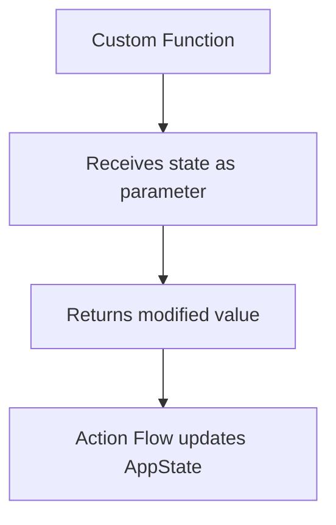

Editing Custom Code
After successfully installing the Visual Studio Code extension and downloading the code, you can initialize your session to start adding or editing custom code.

Currently, the following resources are available for customization:

- Custom Actions: in the lib/custom_code/actions directory
- Custom Widgets: in the lib/custom_code/widgets directory
- Custom Functions: in lib/flutter_flow/custom_functions.dart
- Package Dependencies: in pubspec.yaml

### Custom Function Access to AppState in FlutterFlow

Custom functions in FlutterFlow **cannot directly access AppState (`FFAppState`)** due to intentional design constraints. Here's why and how to resolve it:

#### 🔍 Why Custom Functions Can't Access AppState
1. **Import Restrictions**  
   Custom functions **cannot import any external libraries**, including `ff_app_state.dart`[4][3]. Attempting to import causes parsing errors like:  
   `The function 'FFAppState' isn't defined`[1][5].

2. **Architectural Constraints**  
   FlutterFlow limits custom functions to **pure computations** without side effects. They're designed to:  
   - Operate only on input parameters  
   - Return values synchronously  
   - Avoid state mutations[3][2].

3. **UI Update Mechanism**  
   AppState updates require triggering widget rebuilds via `notifyListeners()`, which is incompatible with custom functions' isolated execution[6].

#### ✅ Workarounds for Reading/Updating AppState
**Option 1: Use Custom Actions Instead**  
```dart
import '/flutter_flow/ff_app_state.dart'; // Allowed in actions

void updateAppState() {
  FFAppState().update(() {
    FFAppState().yourVariable = "New Value"; // Direct update + UI rebuild
  });
}
```

**Option 2: Pass State via Parameters (Custom Functions)**  
1. **Pass AppState values as inputs**:  
   ```dart
   String generateRefNum(String currentState) { // Receive state as parameter
     // ... logic using currentState
     return newValue;
   }
   ```
2. **Update AppState via Action Flow**:  
   - Call function → Capture return value → Use "Update App State" action[1][2].

#### ⚠️ Critical Notes
- **Never import `ff_app_state.dart` in custom functions** – this violates FlutterFlow's execution model[4][3].
- **Custom actions** are the proper tool for state management, supporting:
  - Required imports
  - Asynchronous operations
  - UI rebuild triggers via `FFAppState().update()`[6][2].

#### 📝 Example Workflow


For state-dependent logic, **always prefer custom actions** over custom functions. This maintains proper state encapsulation and UI consistency[1][6][2].

Sources
[1] FFAppState issue https://community.flutterflow.io/widgets-and-design/post/ffappstate-issue-o1fRSC7tiyYQ5cZ
[2] Custom Functions | FlutterFlow Documentation https://docs.flutterflow.io/concepts/custom-code/custom-functions
[3] Error "function is empty or cannot be parsed" while saving ... https://stackoverflow.com/questions/79583665/error-function-is-empty-or-cannot-be-parsed-while-saving-custom-function-in-fl
[4] Writing Custom Code | FlutterFlow Documentation https://docs.flutterflow.io/concepts/custom-code
[5] FFAppState library missing : r/FlutterFlow - Reddit https://www.reddit.com/r/FlutterFlow/comments/1hr8r22/ffappstate_library_missing/
[6] FFAppState | FlutterFlow Documentation https://docs.flutterflow.io/generated-code/ff-app-state/
[7] Set app state via custom function... https://community.flutterflow.io/custom-code/post/set-app-state-via-custom-function-dLaKREWdTSB6Kaz
[8] How can I update the App State value with ... https://community.flutterflow.io/ask-the-community/post/how-can-i-update-the-app-state-value-with-value-from-custom-function-qUtkspPIUfoZTUS
[9] how can i access the app state variable from custom action? https://community.flutterflow.io/actions-logic/post/how-can-i-access-the-app-state-variable-from-custom-action-sBjJUJbnhcH0c5d
[10] Accessing custom function results within an Action https://www.reddit.com/r/FlutterFlow/comments/18gom25/accessing_custom_function_results_within_an_action/
[11] Custom function output as list of data type not working ... https://github.com/FlutterFlow/flutterflow-issues/issues/2691
[12] Read Page State from Custom Function - FlutterFlow Community https://community.flutterflow.io/custom-code/post/read-page-state-from-custom-function-L6HHtP771mpwjUn
[13] App State variable in custom function https://legacy-community.flutterflow.io/c/discuss-and-get-help/app-state-variable-in-custom-function
[14] Custom function not working https://community.flutterflow.io/database-and-apis/post/custom-function-not-working-AFPKVwKgt2hBQQO
[15] Custom Widget and FFAppState - FlutterFlow Community https://community.flutterflow.io/widgets-and-design/post/custom-widget-and-ffappstate-KEqkOSuiJE6B7W7
[16] How to use app state variable list in a custom function ... https://community.flutterflow.io/custom-code/post/how-to-use-app-state-variable-list-in-a-custom-function-without-resetting-0zPTRaaFuFvyy2f
[17] Custom Function Removes Necessary Import Upon Saving ? https://community.flutterflow.io/ask-the-community/post/custom-function-removes-necessary-import-upon-saving-s6tjoYWB7atubGz
[18] Any way to import entries to App State List? - FlutterFlow https://www.reddit.com/r/FlutterFlow/comments/16y2no6/any_way_to_import_entries_to_app_state_list/
[19] How to change state variable in custom function https://community.flutterflow.io/actions-logic/post/how-to-change-state-variable-in-custom-function-L7pMdbFEuYUBgny
[20] App State update from Custom Action & Chart https://community.flutterflow.io/ask-the-community/post/app-state-update-from-custom-action-chart-5PYL9Bu8Y4qedHt
[21] Cant understand why i get a error Custom widget https://community.flutterflow.io/ask-the-community/post/cant-understand-why-i-get-a-error-custom-widget-bpFW5JAF7kJ2YvK
[22] Pretty please: FAppState() in custom functions - FlutterFlow https://legacy-community.flutterflow.io/c/suggestions-and-feedback/pretty-please-fappstate-in-custom-functions
[23] App State | FlutterFlow Documentation https://docs.flutterflow.io/resources/data-representation/app-state/
[24] Custom Function Always Error on Imports https://community.flutterflow.io/ask-the-community/post/custom-function-always-error-on-imports-GBOxOv2ExPQ1MZh
[25] Custom Function import errors https://community.flutterflow.io/ask-the-community/post/custom-function-import-errors-pIRbbOqMqKM9ICz
[26] Utility Functions | FlutterFlow Documentation https://docs.flutterflow.io/resources/functions/utility/
[27] Custom function error https://community.flutterflow.io/ask-the-community/post/custom-function-error-CHmE1AjV2xs4BMM
[28] in custom code section flutterflow not allowing to import ... https://community.flutterflow.io/ask-the-community/post/in-custom-code-section-flutterflow-not-allowing-to-import-package-qRrT7zrqQ9GdBhl
[29] Custom Function with API call not working https://community.flutterflow.io/ask-the-community/post/custom-function-with-api-call-not-working-KCd6gBhFiewfY7V
