# Google OAuth Flow with Interceptor - Sequence Diagram

## Overview

This sequence diagram illustrates the complete Google OAuth flow when using the YouTube API interceptor, including scenarios where user consent is required (authUrl flow).

## Mermaid Sequence Diagram

```mermaid
sequenceDiagram
    participant User as 👤 User
    participant App as 📱 FlutterFlow App
    participant Interceptor as 🔧 OAuth Interceptor
    participant AppState as 💾 FFAppState
    participant GoogleOAuth as 🔐 GoogleOAuthCall
    participant CloudFunc as ☁️ Firebase Function
    participant GoogleAPI as 🌐 Google OAuth Server
    participant YouTubeAPI as 📺 YouTube Data API
    participant Browser as 🌐 Browser

    Note over User, Browser: Scenario 1: Valid Token Available
    
    User->>App: Trigger YouTube API Call
    App->>Interceptor: onRequest(options)
    Interceptor->>AppState: Get current tokens
    AppState-->>Interceptor: accessToken, refreshToken, expiry
    
    alt Token is valid (5min grace period)
        Interceptor->>Interceptor: Token still valid
        Interceptor->>App: Add Authorization header
        App->>YouTubeAPI: API Request with Bearer token
        YouTubeAPI-->>App: Success Response
        App->>Interceptor: onResponse(response)
        Interceptor-->>App: Return response
        App-->>User: Display data
    end

    Note over User, Browser: Scenario 2: Token Expired - Successful Refresh
    
    User->>App: Trigger YouTube API Call
    App->>Interceptor: onRequest(options)
    Interceptor->>AppState: Get current tokens
    AppState-->>Interceptor: expired accessToken, refreshToken, expiry
    
    Interceptor->>Interceptor: Token expired, needs refresh
    Interceptor->>GoogleOAuth: call(userId, accessToken, refreshToken, expiry)
    GoogleOAuth->>CloudFunc: POST /googleOauth/auth/google/refresh
    CloudFunc->>GoogleAPI: Refresh token request
    GoogleAPI-->>CloudFunc: New tokens
    CloudFunc-->>GoogleOAuth: {accessToken, refreshToken, expiryDate}
    GoogleOAuth-->>Interceptor: Success response with new tokens
    
    Interceptor->>AppState: Update tokensMap with new tokens
    Interceptor->>App: Add Authorization header with new token
    App->>YouTubeAPI: API Request with new Bearer token
    YouTubeAPI-->>App: Success Response
    App->>Interceptor: onResponse(response)
    Interceptor-->>App: Return response
    App-->>User: Display data

    Note over User, Browser: Scenario 3: Refresh Failed - User Consent Required
    
    User->>App: Trigger YouTube API Call
    App->>Interceptor: onRequest(options)
    Interceptor->>AppState: Get current tokens
    AppState-->>Interceptor: invalid/expired tokens
    
    Interceptor->>GoogleOAuth: call(userId, accessToken, refreshToken, expiry)
    GoogleOAuth->>CloudFunc: POST /googleOauth/auth/google/refresh
    CloudFunc->>GoogleAPI: Refresh token request
    GoogleAPI-->>CloudFunc: Error: refresh_token invalid/expired
    CloudFunc-->>GoogleOAuth: {authUrl: "https://accounts.google.com/oauth/authorize?..."}
    GoogleOAuth-->>Interceptor: Response with authUrl (no tokens)
    
    alt Interceptor detects authUrl in response
        Interceptor->>App: Return original options (no auth header)
        App->>YouTubeAPI: API Request without auth
        YouTubeAPI-->>App: 401 Unauthorized
        App->>Interceptor: onResponse(401 response)
        Interceptor->>Interceptor: Detect auth error
        
        Note over Interceptor, Browser: Fallback to manual auth flow
        Interceptor->>App: Trigger googleAuth action block
        App->>GoogleOAuth: call() - retry for authUrl
        GoogleOAuth-->>App: {authUrl: "https://accounts.google.com/..."}
        App->>Browser: launchURL(authUrl)
        
        Browser->>GoogleAPI: User consent flow
        User->>Browser: Grant permissions
        GoogleAPI->>Browser: Redirect with auth code
        Browser->>CloudFunc: Callback with auth code
        CloudFunc->>GoogleAPI: Exchange code for tokens
        GoogleAPI-->>CloudFunc: New tokens
        CloudFunc->>AppState: Update user tokens
        Browser-->>User: Close/redirect back to app
        
        Note over User, App: User retries the action
        User->>App: Retry YouTube API Call
        App->>Interceptor: onRequest(options) - with new tokens
        Interceptor->>AppState: Get fresh tokens
        AppState-->>Interceptor: new valid tokens
        Interceptor->>App: Add Authorization header
        App->>YouTubeAPI: API Request with Bearer token
        YouTubeAPI-->>App: Success Response
        App-->>User: Display data
    end

    Note over User, Browser: Scenario 4: API Response Auth Error (401/403)
    
    User->>App: Trigger YouTube API Call
    App->>Interceptor: onRequest(options)
    Interceptor->>AppState: Get current tokens
    Interceptor->>App: Add Authorization header (token seems valid)
    App->>YouTubeAPI: API Request with Bearer token
    YouTubeAPI-->>App: 401/403 Auth Error (token actually invalid)
    
    App->>Interceptor: onResponse(401 response)
    Interceptor->>Interceptor: Detect auth error
    Interceptor->>GoogleOAuth: Attempt token refresh
    
    alt Refresh succeeds
        GoogleOAuth-->>Interceptor: New tokens
        Interceptor->>AppState: Update tokens
        Note over Interceptor: Could retry request here (future enhancement)
        Interceptor-->>App: Return 401 (let app handle retry)
    else Refresh fails with authUrl
        GoogleOAuth-->>Interceptor: {authUrl: "..."}
        Interceptor-->>App: Return 401 + trigger consent flow
        Note over App, Browser: Same consent flow as Scenario 3
    end
```

## Key Flow Points

### 1. **Token Validation Logic**
- Interceptor checks token expiry with 5-minute grace period
- Matches the logic in the existing OAuth submodule
- Prevents unnecessary refresh calls

### 2. **Refresh vs Consent Decision**
- `GoogleOAuthCall` returns either:
  - **Tokens**: `{accessToken, refreshToken, expiryDate}` - refresh successful
  - **AuthUrl**: `{authUrl: "https://accounts.google.com/..."}` - user consent needed

### 3. **AuthUrl Consent Flow**
- When `authUrl` is returned, it means:
  - Refresh token is invalid/expired
  - User needs to re-grant permissions
  - New consent is required for scopes
- App launches browser with the consent URL
- User completes OAuth flow in browser
- Tokens are updated via callback mechanism

### 4. **Interceptor Limitations**
- Interceptor cannot directly handle browser-based consent flow
- Falls back to existing `googleAuth` action block for consent
- User must retry the action after consent is complete

### 5. **Error Recovery**
- 401/403 responses trigger automatic refresh attempt
- If refresh fails, guides user through consent flow
- Maintains app state consistency throughout

## Integration Points

### With Existing OAuth Submodule
- ✅ Uses same `GoogleOAuthCall` endpoint
- ✅ Maintains `FFAppState().tokensMap` structure  
- ✅ Respects 5-minute grace period
- ✅ Leverages existing consent flow infrastructure

### With FlutterFlow App
- ✅ Seamless integration with existing API calls
- ✅ No changes needed to existing consent UI
- ✅ Backward compatible with manual token management

## Benefits of This Design

1. **Automatic Token Management** - Handles 90% of cases without user intervention
2. **Graceful Consent Handling** - Falls back to proven consent flow when needed
3. **Consistent User Experience** - Uses existing OAuth UI patterns
4. **Robust Error Recovery** - Multiple fallback mechanisms
5. **Zero Breaking Changes** - Works with existing app architecture

## Future Enhancements

1. **Automatic Retry** - Interceptor could retry failed requests after token refresh
2. **Consent UI Integration** - Direct integration with consent flow (requires FlutterFlow support)
3. **Proactive Refresh** - Refresh tokens before they expire
4. **Multi-API Support** - Extend pattern to other Google APIs
